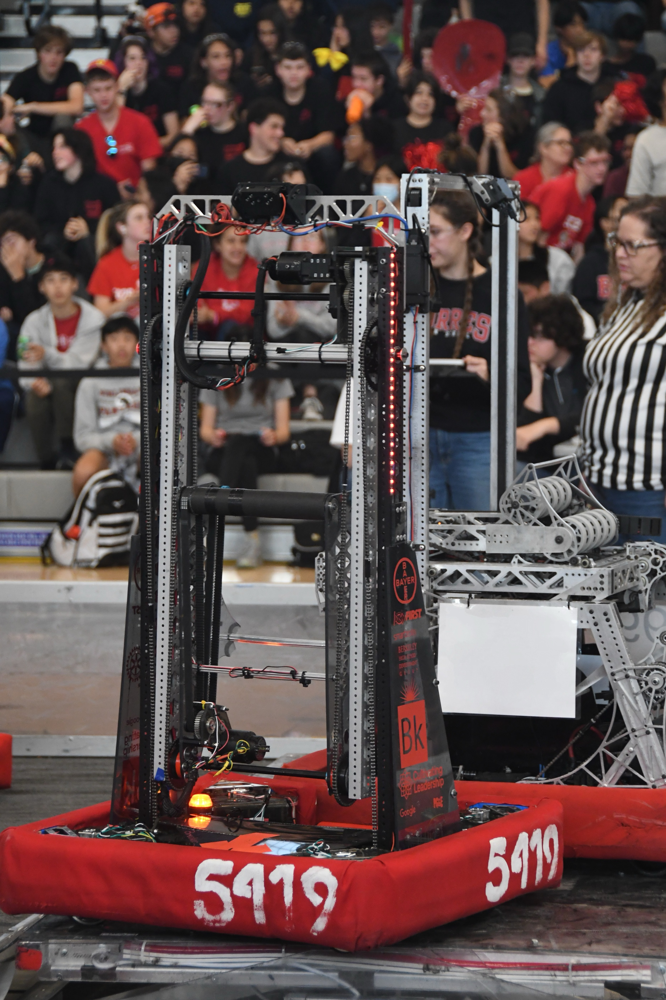

# Welcome to the codebase of our offseason bot, TARS



This codebase was made based off the [6672 code](https://github.com/FusionCorps/2023-Ignition), with heavy chages. 

## Code hilights


- [`team5419.subsystems.arm`](src/main/java/frc/robot/subsystems/arm)

  Contains the `OptimizedArm` class, providing the functionality of the arm, as well as the `GraphStator` class witch provides the logic behind the movement of the arm, 
  esuring it can move in paralell without hitting the chassis of the robot.

  For refrence in the `GraphStaor` class, the sectors are layed out like this:

  ```
  
  E |________| B

        A
    ________ F
  D |        | C
  
  ```
  
  Where A is at (0, 0), moving toward positive x is moving the bicep joint toward the front of the bot, and moving positive is moving the wrist clockwise.

- [`com.team5419.frc2023.loops`](src/main/java/com/team5419/frc2023/loops)

  Contains codes for loops, which are routines that run periodically on the robot, such as for calculating robot pose,
  processing vision feedback, or updating subsystems. All loops implement
  the [`Loop`](src/main/java/com/team5419/frc2023/loops/Loop.java) interface and are handled (started, stopped, added)
  by the [`Looper`](src/main/java/com/team5419/frc2023/loops/Looper.java) class, which runs at 100 Hz.
  The [`Robot`](src/main/java/com/team5419/frc2023/Robot.java) class has one main looper, `mEnabledLooper`, that runs
  all loops when the robot is enabled.
